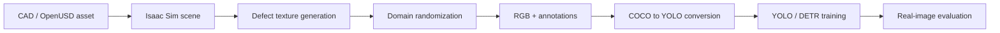

# Master's Thesis: Synthetic Data Generation for Industrial Quality Inspection

> End-to-end Master's thesis workflow for generating synthetic defect data, training computer-vision models, and evaluating sim-to-real performance.

For my Master's thesis, I developed a synthetic-data-generation workflow in NVIDIA Isaac Sim and Omniverse. It covers defect-material preparation, controllable scene and defect randomization, automated annotation generation, dataset conversion, YOLO and DETR training, and evaluation on real industrial inspection images.


## Defect Generation Extension

The workflow uses an Isaac Sim / Omniverse Kit extension to select a target USD prim, project a defect material, assign semantic labels, randomize defect placement and dimensions, and run Replicator data capture from one UI.


▶️ [Watch the 2:16 extension demonstration](docs/media/defect-extension-demo.webm)

The accompanying [technical walkthrough](docs/defect-generation-extension.md) documents the controls, generation sequence, dent material maps, installation, and role of the extension in the complete workflow.

## Problem

Industrial defect datasets are expensive and imbalanced: rare defects are difficult to capture, labeling is slow, and variations in material, lighting, viewpoint, and background create a substantial domain gap. The project addressed this with controllable synthetic-data generation and systematic model evaluation.

## Architecture



## Repository contents

The repository includes:

- a dependency-light COCO-to-YOLO annotation converter that can be tested without Isaac Sim
- the defect-generation extension, UI screenshot, and working demonstration
- a four-map dent material sample: albedo, normal, roughness, and metallic
- the complete extension package under [`defects_extension/`](defects_extension)

The converter validates category mappings, clips boxes to image bounds, and writes normalized YOLO labels.

```bash
python -m synthetic_inspection.annotation_converter \
  --coco annotations.json \
  --output labels \
  --category-map category_map.json
```

## Domain-randomization design

The example configuration in [`configs/domain_randomization.yaml`](configs/domain_randomization.yaml) captures the project dimensions without exposing proprietary assets:

- lighting intensity, direction, and color temperature
- camera pose, focal length, and distance
- surface albedo, roughness, and normal-map variation
- defect position, scale, rotation, texture, and severity
- background and distractor variation

## Approved project evidence

### Synthetic samples


### Real-image evaluation examples


The Master's thesis trained and evaluated YOLO and DETR models and reported 94% accuracy on real-world inspection images. The proprietary evaluation dataset is not public, so this result is reported as a thesis outcome rather than claimed as reproducible from the included files alone.

## Limitations

- Proprietary CAD data, inspection images, trained weights, and company-specific assets are excluded.
- Isaac Sim APIs evolve; integration code should be pinned to the chosen simulator release.
- The included tests validate annotation conversion only, not rendering or model training.

## Run the tests

```bash
python -m pytest
```

## License and attribution

Original thesis workflow documentation and repository utilities are MIT licensed. Thesis visuals and supplied material samples are published with external approval. The extension contains its applicable license, with dependency details centralized in [`THIRD_PARTY_NOTICES.md`](THIRD_PARTY_NOTICES.md).
