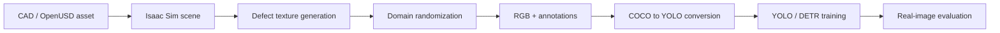

# Synthetic Data for Industrial Quality Inspection

> Public technical reconstruction of an approved master's thesis project. Proprietary source code, CAD assets, datasets, and trained weights are not included.

This case study documents an end-to-end workflow for generating synthetic defect images in NVIDIA Isaac Sim / Omniverse, converting annotations, training object detectors, and evaluating sim-to-real behavior on real inspection images.


## Thesis extension demonstration

The thesis workflow used an Isaac Sim / Omniverse Kit defect-generation extension to select a target USD prim, project a defect material, assign semantic labels, randomize defect placement and dimensions, and run Replicator data capture from one UI.


▶️ [Watch the 2:16 extension demonstration](docs/media/defect-extension-demo.webm)

The accompanying [technical walkthrough](docs/defect-generation-extension.md) documents the controls, generation sequence, dent material maps, installation path, and the boundary between the thesis integration and NVIDIA's upstream sample code.

## Problem

Industrial defect datasets are expensive and imbalanced: rare defects are difficult to capture, labeling is slow, and variations in material, lighting, viewpoint, and background create a substantial domain gap. The project addressed this with controllable synthetic-data generation and systematic model evaluation.

## Architecture



## Public implementation

The repository includes:

- a dependency-light COCO-to-YOLO annotation converter that can be tested without Isaac Sim
- the extension UI screenshot and working demonstration captured during the thesis workflow
- a four-map dent material sample: albedo, normal, roughness, and metallic
- an attributed snapshot of NVIDIA's Apache-2.0 defect-extension foundation under [`third_party/`](third_party/nvidia-defects-extension)

The converter validates category mappings, clips boxes to image bounds, and writes normalized YOLO labels.

```bash
python -m synthetic_inspection.annotation_converter \
  --coco annotations.json \
  --output labels \
  --category-map category_map.json
```

## Domain-randomization design

The example configuration in [`configs/domain_randomization.yaml`](configs/domain_randomization.yaml) captures the project dimensions without exposing proprietary assets:

- lighting intensity, direction, and color temperature
- camera pose, focal length, and distance
- surface albedo, roughness, and normal-map variation
- defect position, scale, rotation, texture, and severity
- background and distractor variation

## Approved project evidence

### Synthetic samples


### Real-image evaluation examples


The thesis project trained and evaluated YOLO and DETR models and reported 94% accuracy on real-world inspection images. The public repository does not include the proprietary dataset, so this number is documented as a project result rather than claimed as reproducible from this repository alone.

## Limitations

- This release is a public reconstruction, not the internal production repository.
- CAD data, inspection images, trained weights, and company-specific pipeline code are excluded.
- Isaac Sim APIs evolve; integration code should be pinned to the chosen simulator release.
- The vendored NVIDIA extension snapshot is upstream code used as a thesis foundation; it is not presented as original authorship.
- The included tests validate annotation conversion only, not rendering or model training.

## Run the tests

```bash
python -m pytest
```

## License and attribution

Original public reconstruction code is MIT licensed. Thesis visuals and supplied material samples are published with external approval. The vendored NVIDIA defect-extension snapshot retains its Apache-2.0 license and upstream copyright notices; see [`THIRD_PARTY_NOTICES.md`](THIRD_PARTY_NOTICES.md). NVIDIA Isaac Sim and Omniverse remain subject to their respective NVIDIA licenses.
