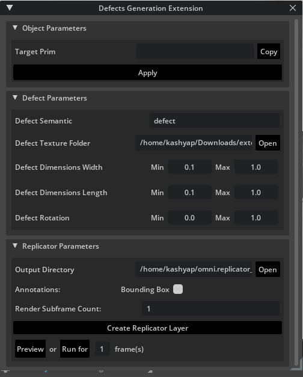
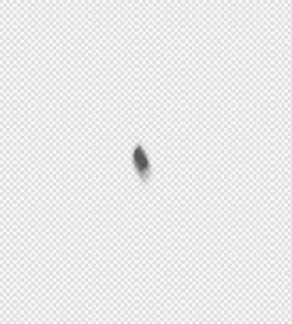
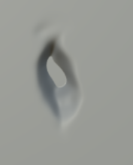
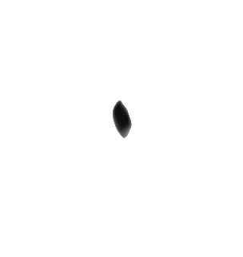

# Defect Generation Extension

## Role in the Master's thesis

This extension provided a single control surface for applying projected defects to a selected OpenUSD prim and configuring NVIDIA Replicator output. It connected material-based defect authoring with repeatable synthetic-data capture for industrial visual-inspection experiments.

▶️ [Watch the 2:16 recorded demonstration](media/defect-extension-demo.webm)

## Controls and data flow

| Area | Purpose |
| --- | --- |
| Target Prim | Copies the selected USD prim path and applies the projection proxy/material setup. |
| Defect Semantic | Defines the class label used by Replicator annotators. |
| Texture Folder | Supplies matching defect texture maps selected during randomization. |
| Width, length, rotation | Defines uniform randomization ranges for defect scale and orientation. |
| Output Directory | Selects where rendered RGB images and annotations are written. |
| Annotation options | Enables semantic segmentation and/or tight 2D bounding boxes. |
| Render subframes | Allows additional RTX subframes to reduce transient rendering artifacts. |
| Preview / Run | Builds the Replicator layer, previews one randomized state, or captures a specified frame count. |

The extension creates a projected material on the target prim, scatters the defect proxy over its surface, randomizes pose and dimensions, and sequences compatible texture sets. Replicator's `BasicWriter` then records RGB images and the selected annotations.

## Dent material sample

The supplied dent is represented by four physically based rendering maps belonging to the same defect:

| Albedo / diffuse (`_D`) | Normal (`_N`) | Roughness (`_R`) | Metallic (`_M`) |
| --- | --- | --- | --- |
|  |  |  |  |

The extension sequences diffuse, normal, and roughness files using the `_D`, `_N`, and `_R` suffixes. The metallic map is retained as part of the supplied PBR material set, but the current projection-material call does not consume `_M` without an additional implementation change.

## Installation

1. Open the Extension Manager in the compatible Isaac Sim or Omniverse Kit application.
2. Add `defects_extension/exts` as an extension search path.
3. Enable the `omni.example.defects` extension.
4. Select a target prim, copy its path in the extension, and apply the projection setup.
5. Choose a compatible defect texture folder and output directory.
6. Configure randomization ranges and annotations, then preview or run the requested frame count.

The extension documentation reports testing with Omniverse Code 2022.3.3 or later. Isaac Sim and Replicator APIs evolve, so migration may be required for current releases.

## Master's thesis contribution

The developed workflow connects the extension with the thesis scene, defect-material preparation, synthetic-data parameterization, automated generation, annotation handling, model training, and downstream evaluation on real inspection images.
